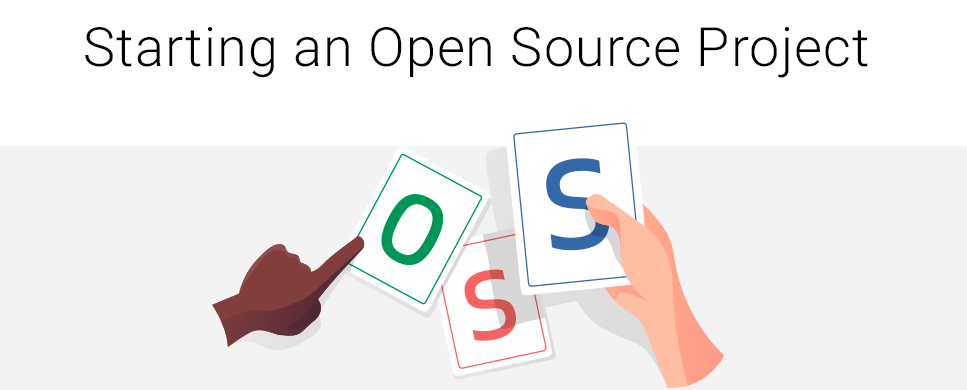

# Pro Track

## Want to start your own open source project
GDSC RAIT come up with an opportunity for all students to host their own open-source project under gdsc rait, 

If you have a great project plan but not enough team members then we provide you the chance to work with our community members and to make your project or plan open-source under gdsc rait and take other help to build your own idea, 

In order to host your own project, submit your project plan by following google form, and our team will allocate you repo and discord channel to work with gdsc rait community.

- Make own project

- Take help from community

- Dedicated project repository in Gdsc 

- Dedicated discord channel

### Registration for project submission
Submit your project plan by filling this form: https://forms.gle/ZnFCbZ1aQ45jQoq38

### Contact

Maintainer : jadhavakshay0701@gmail.com

## LICENSE
Copyright (c) *GDSC Rait*. All rights reserved. Licensed under the MIT License

